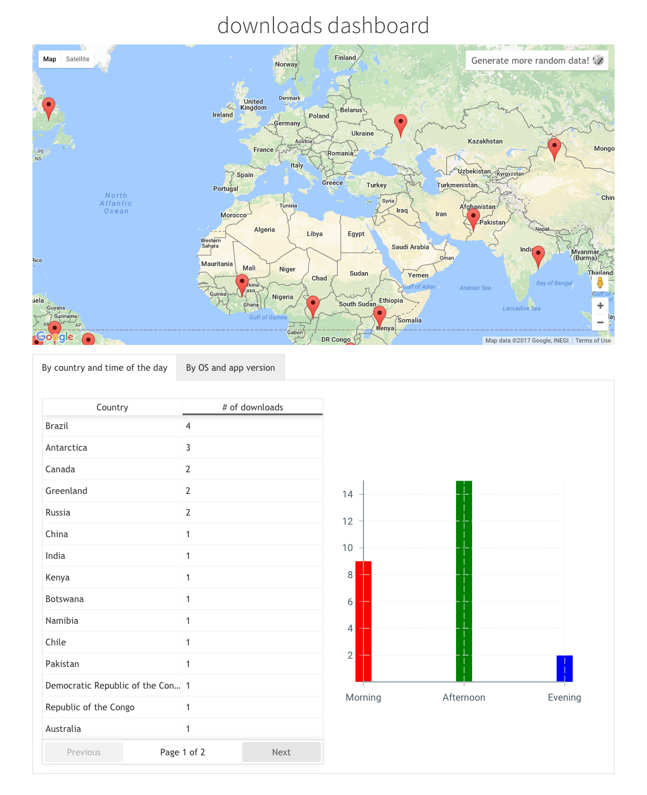

# Embrace downloads dashboard

Welcome! :)

## How to manually install

Prerequisites: Node, Yarn, Go.

1.  `cd ~/<projects_folder>`
2.  `git clone https://github.com/stenowtf/embrace-downloads.git`
3.  `cd cd embrace-downloads/ed-client`
4.  `yarn install` or `npm install`
5.  `yarn start` or `npm start`
6.  `cd $GOPATH/src/github.com/stenowtf`
7.  `ln -s ~/<projects_folder>/embrace-downloads/ed-server ed-server`
8.  `go get gopkg.in/gorethink/gorethink.v3 github.com/gorilla/websocket github.com/mitchellh/mapstructure`
9.  `cd ed-server && go run *.go`
10. `brew update && brew install rethinkdb`
11. `rethinkdb`
12. Navigate to: [`http://localhost:8080/#dataexplorer`](http://localhost:8080/#dataexplorer) and run this two commands:
    -   `r.dbCreate('edserver');`
    -   `r.db('edserver').tableCreate('marker');`
13. Finally open [`http://localhost:3000`](http://localhost:3000)

## How to install using Docker

1.  `cd ~/<projects_folder>`
2.  `git clone https://github.com/stenowtf/embrace-downloads.git`
3.  `cd cd embrace-downloads`
4.  `git checkout docker`
5.  `docker-compose up`
6. Navigate to: [`http://localhost:8080/#dataexplorer`](http://localhost:8080/#dataexplorer) and run this two commands:
    -   `r.dbCreate('edserver');`
    -   `r.db('edserver').tableCreate('marker');`
7.  Open [`http://localhost:3000`](http://localhost:3000)

## Description

Once you opened [`http://localhost:3000`](http://localhost:3000) you can see three different areas, a map and two graphs:

On the map, you can click on it to simulate a download, but you can also use the link beneath to generate some random data.

The two graphs represent the total downloads by country and by time of the day.

Of course, you can open two different tabs and see real-time changes.

#### FAQs:

Q. I get `ReferenceError: google is not defined`. What's going on?

A. Networking error, try to refresh the page.

